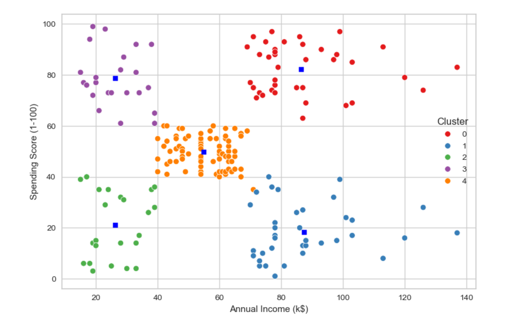
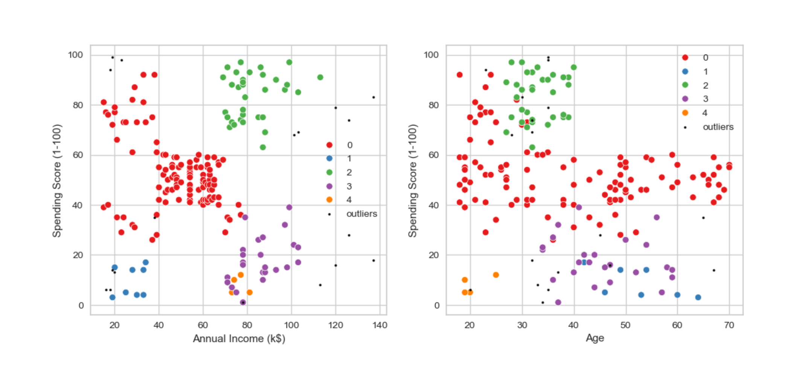
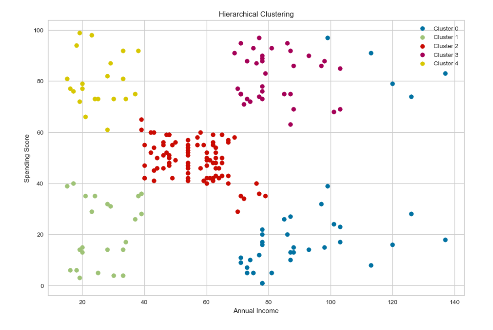

# Clustering Shopping Mall Customers

 
  
## Project Overview
In this project, I aim to identify target customers for a shopping mall, and guide the marketing team in developing marketing strategies and promotions to target specific demographics more effectively. Customer Segmentation is one the most important applications of unsupervised learning. Using clustering techniques, companies can identify the several segments of customers allowing them to target the potential user base. In this machine learning project, I will make use of three main clustering algorithm, K-Means Clustering, DBSCAN, and Hierarchical Clustering, combined with visualizations of clusters.

 

## Project Structure
The main parts of this project include:
- Part 1: Comprehensive Exploratory Data Analysis and Visualizations
- Part 2: Deploying the K-Means Clustering Algorithm Using scikit-learn package
- Part 3: Investigating the DBSCAN Algorithm and Visualizing the Clusters
- Part 4: Exploring the Hierarchical Clustering, Creating Dendograms and Visualizing the Clusters

 

## Dataset 
The dataset is aquired from kaggle and the link is as follows:

https://www.kaggle.com/nelakurthisudheer/mall-customer-segmentation

- The dataset consists of following five features of 200 customers:

- CustomerID: Unique ID assigned to the customer

- Gender: Gender of the customer

- Age: Age of the customer
  
- Annual Income (k$): Annual Income of the customer

- Spending Score (1-100): Score assigned by the mall based on customer behavior and spending nature.

 

## Exploratory Data Analysis
A detailed exploratory data analysis was conducted to understand the dataset, identify patterns, and gain insights. This involved checking for missing and duplicated values, analyzing the distribution of `Annual income' and `Spending Scores` for men and women shoppers, and exploring the relationship between `Spending score and Annual Income`, and then the relationship between `Spending score and Age`:

    
    

 

 

 

## K-Means Clustering

K-Means is a popular and widely used clustering algorithm that partitions the data into K distinct clusters. The algorithm works by iteratively assigning data points to one of the K clusters based on the minimum distance to the cluster centroids. After assignment, the centroids are recalculated until the algorithm converges, resulting in clusters that minimize the within-cluster variance.

In this project, K-Means was used to segment customers based on their shopping behaviors, such as `spending score` and `annual income`. The optimal number of clusters was determined using the Elbow Method, which helps to identify the point where the distortion begins to diminish. The resulting clusters were visualized in both 2D and 3D to give a clear representation of the distinct customer segments.

    
    

## DBSCAN

DBSCAN (Density-Based Spatial Clustering of Applications with Noise) is a `density-based clustering algorithm` that identifies clusters based on the density of data points. Unlike K-Means, DBSCAN does not require the number of clusters to be specified beforehand and is capable of finding arbitrarily shaped clusters. It works by connecting points that are closely packed together, with points in `low-density regions` considered as `noise or outliers`.

In this project, DBSCAN was applied to the dataset to explore customer segments in a non-parametric way. The algorithm was particularly useful in identifying core samples of high-density areas and distinguishing them from outliers. The clusters formed by DBSCAN provided insights into the customer segments that K-Means might have missed, especially in terms of identifying small, dense groups of customers.

 

## Hierarchical Clustering

Hierarchical clustering is an algorithm that builds a `hierarchy of clusters` either in an agglomerative (bottom-up) or divisive (top-down) manner. In this project, agglomerative clustering was used, where each data point starts as its own cluster, and pairs of clusters are merged as one moves up the hierarchy. The process continues until all points are in a single cluster or a defined number of clusters is reached.

Dendrograms were used to visualize the hierarchy and determine the optimal number of clusters by identifying the largest distance between two successive merges. Hierarchical clustering provided a different perspective on customer segmentation, offering a clear depiction of how individual customers and clusters are related at various levels of the hierarchy.

 

## Conclusion
Clustering a mall customers or more generally, any retail companies’ customers, based on their shopping behavior and characteristics can provide us with valuable insights for strategic decision-making.

By segmenting customers into distinct groups, the company can tailor marketing strategies and promotions to target specific demographics more effectively. This approach allows for per- sonalized customer experiences, enhances customer satisfaction, and drives sales by offering relevant products and services.

Additionally, understanding different customer segments helps optimize store layouts, inven- tory management, and promotional activities. Segmentation also enhances recommenda- tion systems by allowing for more accurate and personalized product suggestions based on the specific preferences and behaviors of each customer group. This targeted approach improves operational efficiency and boosts profitability while providing a more engaging shopping experience.
 
 

